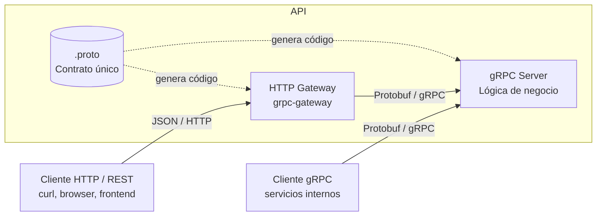

Hay enfoques de desarrollo que eliges por convicción. Otros que eliges por conveniencia. Están los que adoptas porque no conoces otra opción. Y los que en algún sitio de la empresa se convirtieron en religión, así que ya no es solo una decisión técnica: es un tema de integración empresarial.<!--break-->

Las APIs en Go con gRPC y HTTP Gateway son un ejemplo de esta última categoría. No es que no puedas montar una API REST tradicional con Go. Ni que no puedas usar gRPC sin gateway. Ni que no puedas usar otro lenguaje para el backend y Go solo para el gateway. Pero si tu empresa ya tiene un ecosistema gRPC junto con HTTP Gateway, con librerías, convenciones, ejemplos, documentación, y un equipo que sabe cómo funciona, entonces este enfoque es la opción más pragmática.

## Explicación del enfoque

El enfoque no es revolucionario. Es disciplinado. Y esa es precisamente su virtud.

En el centro está el contrato. Un fichero `.proto`. Ahí defines mensajes, servicios y, si quieres exponer HTTP, las anotaciones que describen cómo se mapea cada método a una ruta y un verbo. Ese contrato no es documentación. Es la fuente de verdad. De ahí salen los tipos Go, los stubs gRPC, los handlers del gateway y, si te organizas bien, hasta el OpenAPI.

A partir de ahí, el sistema se divide en dos caras que comparten cerebro.

La primera cara es el servidor gRPC. Es donde vive la lógica de negocio. Donde aplicas interceptores, auth, métricas, tracing, validaciones. Es binario, eficiente, tipado, explícito. Es el idioma interno del sistema.

La segunda cara es el HTTP Gateway. No tiene lógica propia. No debería. Su trabajo es traducir JSON ↔ Protobuf y HTTP ↔ gRPC. Hace de intérprete entre el mundo REST y el mundo RPC. Si mañana decides que tu backend solo habla gRPC puro, la lógica sigue intacta. Si decides que necesitas exponer REST para terceros, tampoco duplicas nada.

Visualmente, es algo así:



Hay varios detalles importantes que no se ven en el diagrama, pero que son los que realmente justifican el patrón.

- Primero, no hay dos implementaciones. Solo hay una. Si creamos un método, se implementa una vez, en el servidor gRPC. El gateway solo genera un adaptador que convierte la request HTTP en una llamada gRPC. Eso evita el clásico antipatrón de “tenemos una API REST pública y otra interna que hacen cosas parecidas pero no iguales”.
- Segundo, el contrato fuerza conversaciones incómodas antes de escribir código. Si quieres cambiar la forma de un mensaje, tienes que tocar el `.proto`. Eso implica regenerar código. Eso implica revisar compatibilidad. Es fricción, sí. Pero es fricción productiva. La alternativa suele ser romper clientes en silencio.
- Tercero, separa responsabilidades de forma limpia. El gateway se ocupa de serialización, routing HTTP y pequeños detalles de integración. El servidor gRPC se ocupa de negocio. Los interceptores se ocupan de cross-cutting concerns: autenticación, logging, métricas, tracing. Cada cosa en su sitio. No porque quede bonito en un diagrama, sino porque cuando el sistema crece, agradecerás no tener middlewares HTTP mezclados con validaciones de dominio.
- Y por último, la razón que nadie pone en las slides: alineación organizativa. Si tu equipo, o tu departamento, o la mitad de la compañía, ya trabaja así, heredas tooling, librerías compartidas, convenciones de error, políticas de seguridad y ejemplos. La elección deja de ser solo una decisión técnica y pasa a ser una decisión de ecosistema.

Que tenga sentido técnico es importante. Que tenga sentido social dentro de la empresa, muchas veces, lo es más.

## Primeros pasos

Aquí vamos a montar un ejemplo mínimo desde cero:

#### 1. Instala Go

Go 1.26+ recomendado. O la última versión que haya. A mi lo que me va es ser un *early adopter*.

#### 2. Generadores

Para trabajar con gRPC necesitamos una serie de generadores de código. El más básico es `protoc-gen-go` para generar los tipos Go a partir de los mensajes Protobuf. Luego, `protoc-gen-go-grpc` para generar los stubs gRPC.
```bash
go install google.golang.org/protobuf/cmd/protoc-gen-go@latest
go install google.golang.org/grpc/cmd/protoc-gen-go-grpc@latest
```

Y para el HTTP Gateway, `protoc-gen-grpc-gateway`:

```bash
go install github.com/grpc-ecosystem/grpc-gateway/v2/protoc-gen-grpc-gateway@latest
```

Y asegúrate de que tu `PATH` incluye el directorio donde se instalan los binarios de Go (`$GOPATH/bin` o `$HOME/go/bin`).

#### 3. Crea el módulo

Para crear un módulo nuevo, lo típico es:

```bash
mkdir grpc-gateway-demo
cd grpc-gateway-demo
go mod init github.com/fernandoescolar/grpc-gateway-demo
```

#### 4. Define el servicio en `.proto`

Ojo aquí: para HTTP annotations, lo normal es `google/api/annotations.proto` (no `google/api/http.proto`), y hay que importarlo así. Además, si quieres que el gateway serialice JSON de forma natural, no hace falta nada raro.

```proto
// proto/hello.proto
syntax = "proto3";

package hello;

option go_package = "github.com/fernandoescolar/grpc-gateway-demo/proto/hello;hello";

import "google/api/annotations.proto";

service Greeter {
  rpc SayHello (HelloRequest) returns (HelloReply) {
    option (google.api.http) = {
      post: "/v1/sayhello"
      body: "*"
    };
  }
}

message HelloRequest {
  string name = 1;
}

message HelloReply {
  string message = 1;
}
```

Para tener la referencia de las anotaciones HTTP, puedes copiar el `annotations.proto` a tu proyecto o usar `buf` para gestionar dependencias de protos. En este ejemplo lo copiaremos directamente:

```bash
mkdir -p proto/google/api
curl -o proto/google/api/annotations.proto https://raw.githubusercontent.com/googleapis/googleapis/master/google/api/annotations.proto
curl -o proto/google/api/http.proto https://raw.githubusercontent.com/googleapis/googleapis/master/google/api/http.proto
```

### 5. Genera el código

Esto asume que tu `protoc` puede encontrar los protos de Google (`google/api/annotations.proto`). Si no los encuentra, la opción pragmática es usar `buf` o vendorizar los protos en el repo. Aquí voy con el comando “directo” que pedías, y luego en secciones posteriores te explico el realismo.

```bash
protoc -I ./proto \
  --go_out=./proto \
  --go_opt=paths=source_relative \
  --go-grpc_out=./proto \
  --go-grpc_opt=paths=source_relative \
  --grpc-gateway_out=./proto \
  --grpc-gateway_opt=paths=source_relative \
  ./proto/hello.proto
```

Esto te genera:

* `proto/hello/hello.pb.go`
* `proto/hello/hello_grpc.pb.go`
* `proto/hello/hello.pb.gw.go` (el gateway)

### 6. Implementa el servidor gRPC

Aquí lo dejamos limpio y con un puerto dedicado para gRPC: `:8080`.

```go
// server/main.go
package main

import (
	"context"
	"log"
	"net"

	hello "github.com/fernandoescolar/grpc-gateway-demo/proto/hello"
	"google.golang.org/grpc"
)

type GreeterServerImpl struct {
	hello.UnimplementedGreeterServer
}

func (g *GreeterServerImpl) SayHello(ctx context.Context, req *hello.HelloRequest) (*hello.HelloReply, error) {
	return &hello.HelloReply{Message: "Hello " + req.Name}, nil
}

func main() {
	lis, err := net.Listen("tcp", ":8080")
	if err != nil {
		log.Fatal(err)
	}

	s := grpc.NewServer()
	hello.RegisterGreeterServer(s, &GreeterServerImpl{})

	log.Println("gRPC server listening on :8080")
	if err := s.Serve(lis); err != nil {
		log.Fatal(err)
	}
}
```

#### 7. Monta el HTTP Gateway

Gateway en `:8081`, llamando al gRPC en `localhost:8080`.

Importante: hoy en día se usa `grpc.WithTransportCredentials(insecure.NewCredentials())` en vez del viejo `WithInsecure()`.

```go
// gateway/main.go
package main

import (
	"context"
	"log"
	"net"
	"net/http"

	hello "github.com/fernandoescolar/grpc-gateway-demo/proto/hello"
	"github.com/grpc-ecosystem/grpc-gateway/v2/runtime"
	"google.golang.org/grpc"
	"google.golang.org/grpc/credentials/insecure"
)

func main() {
	ctx := context.Background()

	mux := runtime.NewServeMux()

	err := hello.RegisterGreeterHandlerFromEndpoint(
		ctx,
		mux,
		"localhost:8080",
		[]grpc.DialOption{grpc.WithTransportCredentials(insecure.NewCredentials())},
	)
	if err != nil {
		log.Fatal(err)
	}

	server := &http.Server{Handler: mux}

	lis, err := net.Listen("tcp", ":8081")
	if err != nil {
		log.Fatal(err)
	}

	log.Println("HTTP gateway server listening on :8081")
	if err := server.Serve(lis); err != nil && err != http.ErrServerClosed {
		log.Fatal(err)
	}
}
```

#### 8. Ejecuta y prueba

En una terminal:

```bash
go run server/main.go
```

En otra:

```bash
go run gateway/main.go
```

Y prueba:

```bash
curl -X POST http://localhost:8081/v1/sayhello \
  -H "Content-Type: application/json" \
  -d '{"name": "Alice"}'
```

Respuesta:

```json
{"message":"Hello Alice"}
```

## Header (HTTP) y Metadata (gRPC)

Aquí es donde empezamos a dejar de jugar a “hola mundo” y entramos en “esto va a producción”. Necesitas que un header HTTP como `X-Request-Id` llegue al handler gRPC. Y que si el handler decide devolver un `X-Request-Id` de vuelta, el cliente HTTP lo vea.

El gateway te deja inyectar funciones para mapear headers entrantes a metadata y para propagar metadata saliente a headers.

Primero: añade un matcher para aceptar headers concretos como metadata. En `gateway/main.go`, cambia el `NewServeMux()` por esto:

```go
mux := runtime.NewServeMux(
	runtime.WithIncomingHeaderMatcher(func(key string) (string, bool) {
		switch http.CanonicalHeaderKey(key) {
		case "X-Request-Id", "Authorization":
			return key, true
		default:
			return runtime.DefaultHeaderMatcher(key)
		}
	}),
)
```

Segundo: en el servidor gRPC, lee metadata. En `server/main.go`:

```go
import (
    // ...
    "google.golang.org/grpc/metadata"
)

func first(v []string) string {
	if len(v) == 0 {
		return ""
	}
	return v[0]
}

func (g *GreeterServerImpl) SayHello(ctx context.Context, req *hello.HelloRequest) (*hello.HelloReply, error) {
	md, _ := metadata.FromIncomingContext(ctx)

	reqID := first(md.Get("X-Request-Id"))
	if reqID == "" {
		reqID = first(md.Get("x-request-id"))
	}

	msg := "Hello " + req.Name
	if reqID != "" {
		msg += " (request-id: " + reqID + ")"
	}

	return &hello.HelloReply{Message: msg}, nil
}
```

Y ya tienes una demo real: `curl` con `-H "X-Request-Id: 123"` y lo ves reflejado.

## Error handling

gRPC tiene códigos canónicos. El gateway los traduce a HTTP. Lo importante es que tú no devuelvas `fmt.Errorf("algo")` como si esto fuese un script, porque entonces todo se convierte en “500 Internal” y la vida es corta.

En `server/main.go`, valida el input y devuelve errores gRPC:

```go
import (
    // ...
    "google.golang.org/grpc/codes"
    "google.golang.org/grpc/status"
)

func (g *GreeterServerImpl) SayHello(ctx context.Context, req *hello.HelloRequest) (*hello.HelloReply, error) {
	if req.GetName() == "" {
		return nil, status.Error(codes.InvalidArgument, "name is required")
	}
	return &hello.HelloReply{Message: "Hello " + req.Name}, nil
}
```

Prueba:

```bash
curl -X POST http://localhost:8081/v1/sayhello \
  -H "Content-Type: application/json" \
  -d '{}'
```

Vas a ver un JSON de error “estilo gateway”. No es el más bonito del mundo, pero al menos tiene semántica. Si quieres que el formato sea el tuyo, puedes meter un error handler custom en el ServeMux. Eso ya es el punto donde el departamento “gRPC believers” empieza a asentir con gravedad.

## OpenAPI/Swagger

Aquí hay dos caminos: “quiero swagger porque la gente lo pide” y “quiero swagger porque lo uso para gobernar cambios”. El segundo merece la pena.

Para generar OpenAPI desde `.proto` normalmente se añade `protoc-gen-openapiv2` (del mismo ecosistema) y una opción extra en `protoc`. Si lo añadimos, encaja perfecto en el conjunto:

Instala el plugin:

```bash
go install github.com/grpc-ecosystem/grpc-gateway/v2/protoc-gen-openapiv2@latest
```

Y genera:

```bash
protoc -I ./proto \
  --openapiv2_out=./openapi \
  --openapiv2_opt=logtostderr=true \
  ./proto/hello.proto
```

Luego puedes servir ese JSON/YAML desde el gateway con un handler estático, por ejemplo montando `http.FileServer` en un path. Como ahora mismo el gateway está usando `runtime.ServeMux`, lo más simple es envolverlo en un `http.ServeMux` estándar:

En `gateway/main.go`, sustituye el `server := &http.Server{Handler: mux}` por algo así:

```go
root := http.NewServeMux()
root.Handle("/", mux)
root.Handle("/openapi/", http.StripPrefix("/openapi/", http.FileServer(http.Dir("./openapi"))))

server := &http.Server{Handler: root}
```

Y ya tienes `/openapi/hello.swagger.json` (o el nombre que genere) accesible.

## Auth/Authz

Autenticación: que el token llegue. Autorización: que no valga con “tener token”.

Para no liar el ejemplo, hacemos un interceptor gRPC que exige `Authorization: Bearer demo` y si no, devuelve `Unauthenticated`. Es cutre, pero demuestra el flujo end-to-end y te deja listo para enchufar JWT real.

En `server/main.go`, añade interceptor:

```go
import (
    // ...
    "strings"
)

func authUnaryInterceptor(
	ctx context.Context,
	req any,
	info *grpc.UnaryServerInfo,
	handler grpc.UnaryHandler,
) (any, error) {
	md, _ := metadata.FromIncomingContext(ctx)
	auth := first(md.Get("Authorization"))
	if auth == "" {
		auth = first(md.Get("authorization"))
	}

	if !strings.HasPrefix(auth, "Bearer ") || strings.TrimPrefix(auth, "Bearer ") != "demo" {
		return nil, status.Error(codes.Unauthenticated, "missing/invalid token")
	}

	return handler(ctx, req)
}
```

Y crea el server con el interceptor:

```go
s := grpc.NewServer(grpc.UnaryInterceptor(authUnaryInterceptor))
```

Prueba sin token:

```bash
curl -X POST http://localhost:8081/v1/sayhello \
  -H "Content-Type: application/json" \
  -d '{"name":"Alice"}'
```

Debe fallar con 401 (traducido desde `Unauthenticated`).

Prueba con token:

```bash
curl -X POST http://localhost:8081/v1/sayhello \
  -H "Content-Type: application/json" \
  -H "Authorization: Bearer demo" \
  -d '{"name":"Alice"}'
```

Debe funcionar.

¿Authz real? Lo normal es que el interceptor construya un “principal” en contexto (user id, roles, tenant) y luego, en cada método, o en otro interceptor por servicio, apliques policy. Si tu empresa tiene OPA/Cedar/RBAC corporativo, aquí es donde te enchufas. Y aquí es donde, otra vez, conviene no ser el bicho raro.

## En el mismo puerto (opcional) con cmux

Dos puertos es fácil. Uno es cómodo. La parte incómoda es que quieres que **el gateway y el gRPC server vivan en el mismo binario**, en el mismo puerto, sin que el ingress te haga ghosting.

Aquí ya dejamos de tener dos `main.go` separados y creamos un único `cmd/api/main.go`. Mantiene todo lo anterior, pero con `cmux`:

```go
// cmd/api/main.go
package main

import (
	"context"
	"log"
	"net"
	"net/http"
	"strings"

	hello "github.com/fernandoescolar/grpc-gateway-demo/proto/hello"
	"github.com/grpc-ecosystem/grpc-gateway/v2/runtime"
	"github.com/soheilhy/cmux"
	"google.golang.org/grpc"
	"google.golang.org/grpc/codes"
	"google.golang.org/grpc/credentials/insecure"
	"google.golang.org/grpc/metadata"
	"google.golang.org/grpc/status"
)

type GreeterServerImpl struct {
	hello.UnimplementedGreeterServer
}

func first(v []string) string {
	if len(v) == 0 {
		return ""
	}
	return v[0]
}

func authUnaryInterceptor(
	ctx context.Context,
	req any,
	info *grpc.UnaryServerInfo,
	handler grpc.UnaryHandler,
) (any, error) {
	md, _ := metadata.FromIncomingContext(ctx)
	auth := first(md.Get("Authorization"))
	if auth == "" {
		auth = first(md.Get("authorization"))
	}
	if !strings.HasPrefix(auth, "Bearer ") || strings.TrimPrefix(auth, "Bearer ") != "demo" {
		return nil, status.Error(codes.Unauthenticated, "missing/invalid token")
	}
	return handler(ctx, req)
}

func (g *GreeterServerImpl) SayHello(ctx context.Context, req *hello.HelloRequest) (*hello.HelloReply, error) {
	if req.GetName() == "" {
		return nil, status.Error(codes.InvalidArgument, "name is required")
	}

	md, _ := metadata.FromIncomingContext(ctx)
	reqID := first(md.Get("X-Request-Id"))
	if reqID == "" {
		reqID = first(md.Get("x-request-id"))
	}

	msg := "Hello " + req.Name
	if reqID != "" {
		msg += " (request-id: " + reqID + ")"
	}

	return &hello.HelloReply{Message: msg}, nil
}

func main() {
	ctx := context.Background()

	// 1) Listener único
	lis, err := net.Listen("tcp", ":8080")
	if err != nil {
		log.Fatal(err)
	}

	m := cmux.New(lis)

	// 2) Separación por tipo de tráfico
	grpcL := m.MatchWithWriters(
		cmux.HTTP2MatchHeaderFieldPrefixSendSettings("content-type", "application/grpc"),
	)
	httpL := m.Match(cmux.HTTP1Fast())

	// 3) gRPC server
	grpcServer := grpc.NewServer(grpc.UnaryInterceptor(authUnaryInterceptor))
	hello.RegisterGreeterServer(grpcServer, &GreeterServerImpl{})

	// 4) HTTP gateway -> dial al mismo puerto
	gw := runtime.NewServeMux(
		runtime.WithIncomingHeaderMatcher(func(key string) (string, bool) {
			switch http.CanonicalHeaderKey(key) {
			case "X-Request-Id", "Authorization":
				return key, true
			default:
				return runtime.DefaultHeaderMatcher(key)
			}
		}),
	)

	conn, err := grpc.NewClient("127.0.0.1:8080",
		grpc.WithTransportCredentials(insecure.NewCredentials()),
	)
	if err != nil {
		log.Fatal(err)
	}
	defer conn.Close()

	if err := hello.RegisterGreeterHandler(ctx, gw, conn); err != nil {
		log.Fatal(err)
	}

	httpServer := &http.Server{Handler: gw}

	// 5) Arranque concurrente
	go func() {
		log.Println("gRPC+HTTP listening on :8080")
		if err := grpcServer.Serve(grpcL); err != nil {
			log.Fatal(err)
		}
	}()

	go func() {
		if err := httpServer.Serve(httpL); err != nil && err != http.ErrServerClosed {
			log.Fatal(err)
		}
	}()

	if err := m.Serve(); err != nil {
		log.Fatal(err)
	}
}
```

Con esto ya no necesitas `server/main.go` y `gateway/main.go`. Tienes un único binario. Un puerto. Una historia que contarle al platform team sin llorar.

Prueba:

```bash
go run cmd/api/main.go
```

Y luego:

```bash
curl -X POST http://localhost:8080/v1/sayhello \
  -H "Content-Type: application/json" \
  -H "Authorization: Bearer demo" \
  -H "X-Request-Id: 123" \
  -d '{"name":"Alice"}'
```

## Conclusión

Este enfoque gRPC + HTTP Gateway no es mágico. No es la panacea. No es la única forma de montar APIs en Go. Pero está bien. Es sólido, escalable, mantenible y, sobre todo, alineado con lo que muchas empresas ya tienen. No es un capricho técnico: es una decisión de ecosistema. Y a veces, eso es lo que más cuenta.
